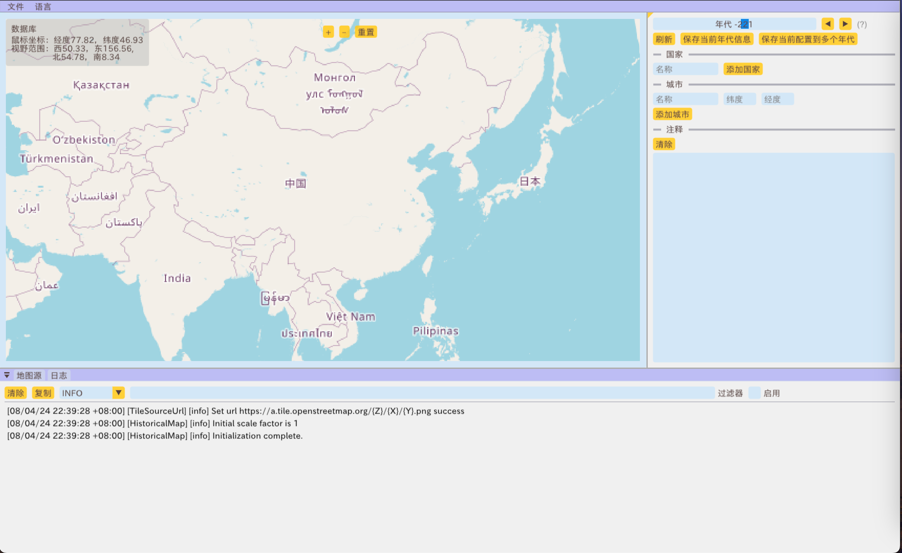

# Historical map 历史地图

当我阅读历史的时候，我常常会对史书上所描述的国家/城市的位置感到困惑，比如在张荫麟先生的《中国史纲》里，
对周朝王畿的描述是“范围现在不能确考，但可知其北不过黄河，南不到汉水流域，东不到淮水流域，西则镐京已接近边陲”，
其大多以山河为参照做一份大致的描述，若读者对地理没有较为深刻的印象，
想必是无法立刻在脑海中勾勒出其轮廓以及相对当代城市/省份/国家的位置的。
并且如果能从地图上直观的看到城镇周边的地形，也能够帮助理解为什么有些城市自古以来就是兵家必争之地。
虽然能在网上查到某些特定年代的地图，这些独立的图片无法直观的反映历史上各个国家的变迁，因此，我便制作了这个小工具，
希望能够对所有的历史爱好者有所帮助。

现在只是实现了我最初所构想的功能，如支持手动输入国家边界线，手动添加重要城市坐标，拨动时间线显示各个国家版图的变迁，
以及导入导出的分享功能和中英文切换。如果在使用中遇到BUG，可以提出issue，我将尽力解决，
由于个人开发时间和精力有限，可能无法及时响应，敬请谅解。

When I read history, I often find myself confused about the locations of countries or cities described in historical records. 
For example, in Mr. Zhang Yinlin’s “An Outline of Chinese History,” the description of the Zhou Dynasty’s royal domain states, 
“The exact boundaries cannot be determined now, but it is known that it did not extend north of the Yellow River, 
south to the Han River basin, east to the Huai River basin, and to the west, Haojing was already near the frontier.” 
Most descriptions use mountains and rivers as references to provide a rough outline. Without a deep impression of geography, 
readers are unlikely to immediately visualize the contours and relative positions of these locations in comparison to contemporary cities, 
provinces, or countries. Moreover, being able to see the terrain surrounding towns on a map helps to understand 
why certain cities have been strategic locations throughout history. Although maps of specific historical periods can be found online, 
these standalone images do not intuitively reflect the changes of various countries over time. 
Therefore, I created this small tool, hoping it will be helpful to all history enthusiasts.

Only the functions I initially conceived have been realized now, such as supporting manual input of national boundaries, 
manually adding the coordinates of important cities, toggling the timeline to display the changes of each country's territory, 
as well as the import and export sharing functions 
and the switch between Chinese and English. If you encounter any BUGs during use, 
you can raise an issue and I will do my best to solve it. 
Due to limited personal development time and energy, I may not be able to respond in a timely manner. 
Thank you for your understanding.

## General tool chian requirements 

1. [Conan 2](https://conan.io/) 
2. cmake >= 3.23
3. Parenthesized initialization of aggregates feature is required, GCC > 10 on Linux, clang = 17.0.6 on MacOS, MSVC >= 19.28 on Windows.

## Compile on Linux

### Setup envirnment

Config the profile if you don't have:

`conan profile detect --force` 

and set the C++ standard to 20 by modifying `settings.compiler.cppstd=gnu20`.

### Compile

1. `conan install . --build=missing -s build_type=Release -c tools.system.package_manager:mode=install -c tools.system.package_manager:sudo=True`
2. `cmake --preset conan-release`
3. `cd build/Release`
4. `cmake --build . -j`
5. Compile translation: `cmake --build . -j --target translation`
6. `ctest` if you want to run test

## Compile on MacOS

### Setup envirnment
1. Download clang from Homebrew: `brew install llvm` 
2. Add Homebrew clang to your path: `export PATH="/opt/homebrew/opt/llvm/bin:$PATH"`
3. Set `CC` and `CXX` to the Homebrew clang: `export CC=/opt/homebrew/opt/llvm/bin/clang && export CXX=/opt/homebrew/opt/llvm/bin/clang++`
4. Config the profile if you don't have: `conan profile detect --force`  and set the C++ standard to 20 by modifying `settings.compiler.cppstd=gnu20`.

### Compile

1. `conan install . --build=missing -s build_type=Release`
2. `cmake --preset conan-release`
3. `cd build/Release`
4. `cmake --build . -j`
5. Compile translation: `cmake --build . -j --target translation`
6. `ctest` if you want to run test

## Compile on Windows

### Setup envirnment

Config the profile if you don't have: `conan profile detect --force`  and set the C++ standard to 20 by modifying `settings.compiler.cppstd=20`.

### Compile

1. `conan install . --build=missing -s build_type=Release`
2. `cmake --preset conan-default`
3. `cd build/`
4. `cmake --build . -j --config Release`
5. `cmake --build . -j --config Release --target translation`
6. `ctest` if you want to run test
